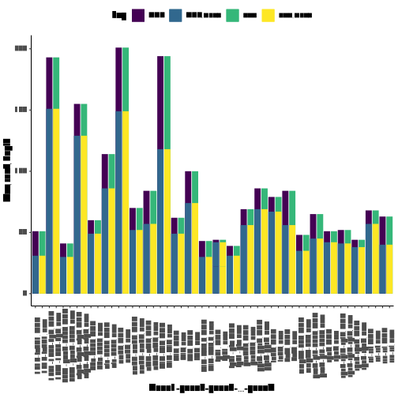

# Use:

ampDepth gets the rough location of an amplicon, the genes
  in an amplicon, and the mean, maximum, and minimum depth
  for amplicons. The graphAmpDepth.r script can be used to
  visualize the depths for each gene (not positions).

# Install:

If Rscript is not in `/usr/bin/`, then set the top line
  (`#!/usr/Rscript`) of graphAmpMap.r to the correct
  location. On a Unix OS you can find this by
  using `find / -name Rscript 2>/dev/null | grep -v "lib"`

```
make;
make install;
```

# Running:

You will need a paf file with the reference gene
  coordinates to run this code. This can be gotten by
  mapping the genes (can download from genbank) to the
  reference genome
  with `minimap2 ref.fasta genes.fasta > out.paf`. You
  will then need to map your reads to the same reference
  and make a sam file
  `minimap2 -a -x map-ont ref.fasta reads.fastq > out.sam`

The first column in the output tsv file is a flag which
  separates out runs in graphAmpDepth.r. You can change
  this with the `-flag "newFlag"` argument.

Print the help message for ampDepth with `ampDepth -h`.

Print the help message for graphAmpDepth with
  `graphAmpDepth -h`.

```
# Make the paf file
minimap2 ref.fasta genes.fasta > out.paf;

# Map the reads to the reference
minimap2 -a -x map-ont ref.fasta reads.fastq > out.sam;

# Get the tsv file read read stats

## Minimum
ampDepth -paf out.paf -sam out.sam -out out.tsv;

## Change the label in column one to ONT
ampDepth -flag ONT -paf out.paf -sam out.sam -out out.tsv;

# Get the graphs

graphAmpDepth out.tsv;
```

You can grab the row of a gene from the tsv made by
  ampDepth by using `grep "geneName" out.tsv`.

# Dummy figure




| flag |  start |  end  | avgAmpDepth | minAmpDepth | maxAmpDepth | entireFirstGene | entireLastGene | firstBaseDepth0 | lastBaseDepth0 | avgDepth0 | minDepth0 | maxDepth0 | geneId0 | firstBaseDepth1 | lastBaseDepth1 | avgDepth1 | minDepth1 | maxDepth1 | geneId1 |
|:----:|:-------|:-----:|:-----------:|:-----------:|:-----------:|:---------------:|:--------------:|:----------------|:---------------|:----------|:----------|:----------|:-------:|:----------------|:---------------|:----------|:----------|:----------|:-------:|
| own  | 6505   |7729   |69           |     21      |    86       |     Part        |      Part      |      25         |      75        |    67     |    25     |    86     |  gyrB   |     75          |      21        |   73      |    21     |    85     |  gyrA   |
| own  | 490818 |491038 |22           |     20      |    24       |     Part        |      NA        |      20         |      21        |    22     |    20     |    24     |  fgd1   |     NA          |      NA        |   NA      |    NA     |    NA     |  NA     |
| own  | 491047 |491080 |200          |     20      |    20       |     Part        |      NA        |      20         |      20        |    20     |    20     |    20     |  fgd1   |     NA          |      NA        |   NA      |    NA     |    NA     |  NA     |

Table: Example of three rows from the tsv output from
  ampDepth
